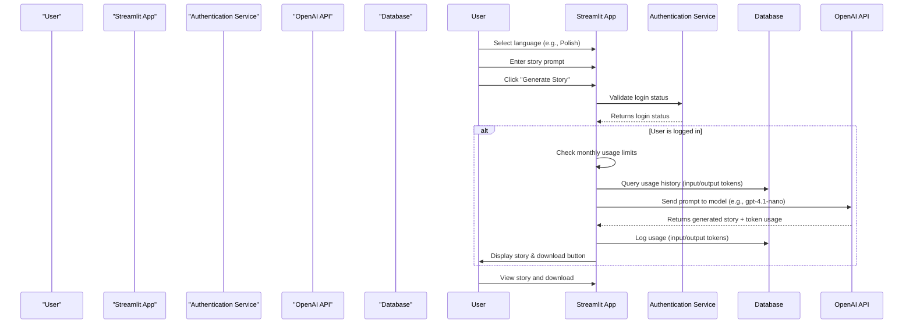
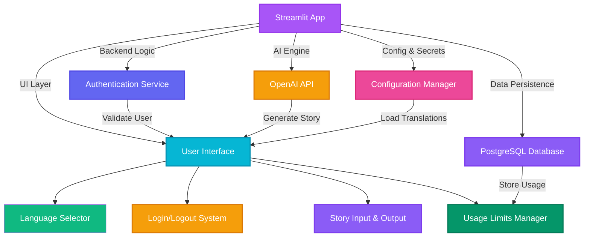

# Short Crime Story Generator 📖
<figure>
    </figcaption>" width="600">
</figure>
---
<a class="md-button md-button--primary" href="https://fairy-tale-generator-ab.streamlit.app/" target="_blank">Go to the application</a>

---

### ✅ 1. **Sequence Diagram – User Login & Story Generation Flow**

This shows the key user flow: login → language selection → input story → generate story → display result.



**Styles (as requested):**
```mermaid
style "User" fill:#A855F7,stroke:#9333EA,stroke-width:2px,color:#fff
style "Streamlit App" fill:#06B6D4,stroke:#0891B2,stroke-width:2px,color:#fff
style "Authentication Service" fill:#10B981,color:#fff
style "OpenAI API" fill:#F59E0B,stroke:#D97706,stroke-width:2px,color:#fff
style "Database" fill:#8B5CF6,stroke:#7C3AED,stroke-width:2px,color:#fff
```

---

### ✅ 2. **Component Diagram – App Architecture**

This shows the core components of your app with clear relationships and responsibilities.



---

### ✅ 3. **Flowchart – Monthly Usage Approval Decision Logic**

This shows how the app checks if a user can generate a new story based on token usage limits.

```mermaid
flowchart TD
    A[User submits new story] --> B{Is user logged in?}
    B -- No --> C[Redirect to login]
    B -- Yes --> D{Is user premium?}
    D -- No --> E[Check free user limits]
    E --> F[Sum input & output tokens from DB]
    F --> G{Input ≥ 2500? OR Output ≥ 3000?}
    G -- Yes --> H[Block request: "Usage limit exceeded"]
    G -- No --> I[Proceed to generate story]
    D -- Yes --> J[Check premium limits: 100k tokens]
    J --> K{Input ≥ 100k? OR Output ≥ 100k?}
    K -- Yes --> H
    K -- No --> I

    style A fill:#A855F7,stroke:#9333EA,stroke-width:2px,color:#fff
    style B fill:#06B6D4,stroke:#0891B2,stroke-width:2px,color:#fff
    style C fill:#10B981,color:#fff
    style D fill:#F59E0B,stroke:#D97706,stroke-width:2px,color:#fff
    style E fill:#8B5CF6,stroke:#7C3AED,stroke-width:2px,color:#fff
    style F fill:#6366F1,stroke:#4F46E5,stroke-width:2px,color:#fff
    style G fill:#EC4899,stroke:#DB2777,stroke-width:2px,color:#fff
    style H fill:#EF4444,stroke:#DC2626,stroke-width:2px,color:#fff
    style I fill:#059669,stroke:#047857,stroke-width:2px,color:#fff
    style J fill:#F59E0B,stroke:#D97706,stroke-width:2px,color:#fff
    style K fill:#F59E0B,stroke:#D97706,stroke-width:2px,color:#fff
```
<!-- *Project start: 2025-04-05* -->

## Overview
A Streamlit-powered storytelling generator that creates engaging, structured short stories using OpenAI's language models, with user authentication, usage tracking, and tiered access based on subscription level.

<!-- ## Project architecture
	in Excalidraw -->

## Main functionalities
- Generates creative, structured short stories (with introduction, development, twist, and moral) from user-provided prompts
- Implements dynamic model rotation among multiple GPT models (e.g., `gpt-4o-mini`, `gpt-4.1-mini`)
- Tracks token usage per user and month with PostgreSQL
- Enforces usage limits: free users (1k input / 10k output tokens), premium users (10k input / 100k output tokens)
- Supports Google OAuth login and subscription management via `st_paywall`
- Provides real-time usage statistics and current model tracking in sidebar
- Allows downloading generated stories as plain text files

## Technologies & skills
- Python
- Streamlit
- OpenAI API
<!-- - PostgreSQL -->
- Create and deploy databases PostgreSQL on Ubuntu server https://cloud.digitalocean.com/droplets?i=0c32ac
- st_paywall (for user subscription management)
- Pandas (data handling)
- psycopg2 (PostgreSQL connector)
- itertools.cycle (for model rotation)

## Project Report
- Implemented token-based usage limits with monthly reset
- Integrated secure Google OAuth login and subscription tier detection
- Designed dynamic model selection to balance performance and cost
- Built robust error handling for unauthenticated users and usage overages
- Added real-time feedback via progress spinner and usage metrics
- Ensured data privacy by storing only necessary usage metadata

## Sample photos

<figure>
    </figcaption>" width="600">
<figcaption></figcaption>
    </figcaption>" width="600">
<figcaption></figcaption>
     </figcaption>" width="600">
<figcaption></figcaption>
    </figcaption>" width="600">
<figcaption></figcaption>
    </figcaption>" width="600">
<figcaption></figcaption>
    </figcaption>" width="600">
<figcaption></figcaption>
</figure>

## Application usage

- Enter a prompt in the text area 
- Click "Generate" to create a story
- View the generated story with model used and download option
- Monitor token usage in the sidebar
- Upgrade to premium for higher limits

---

<a class="md-button md-button--primary" href="https://fairy-tale-generator-ab.streamlit.app/" target="_blank">Go to the application</a>

---