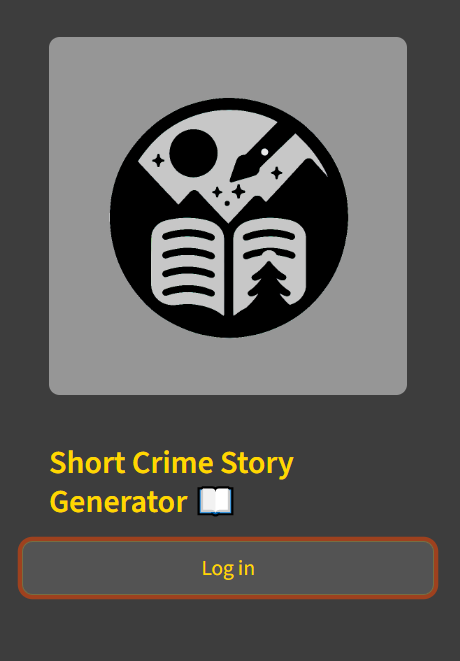
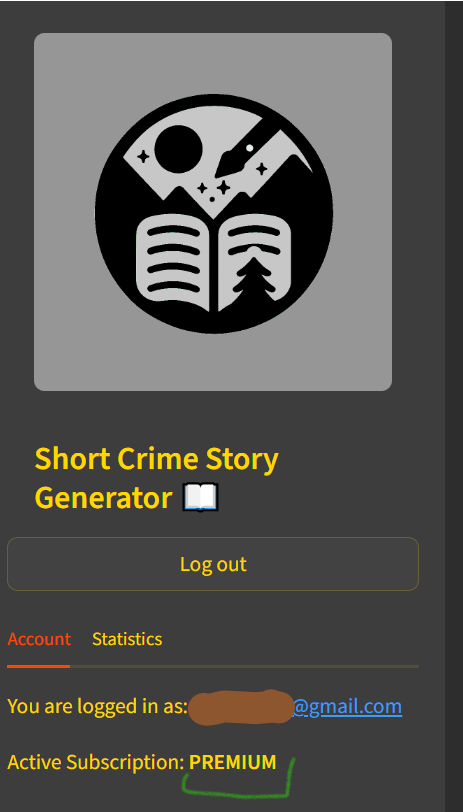
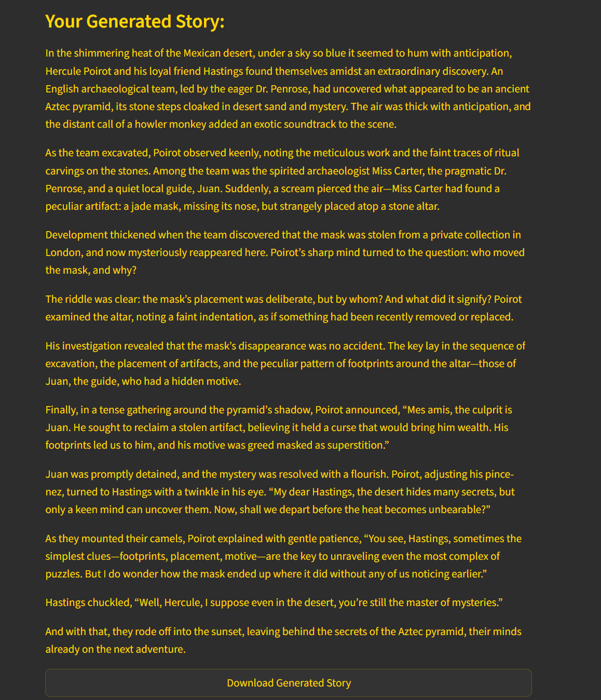
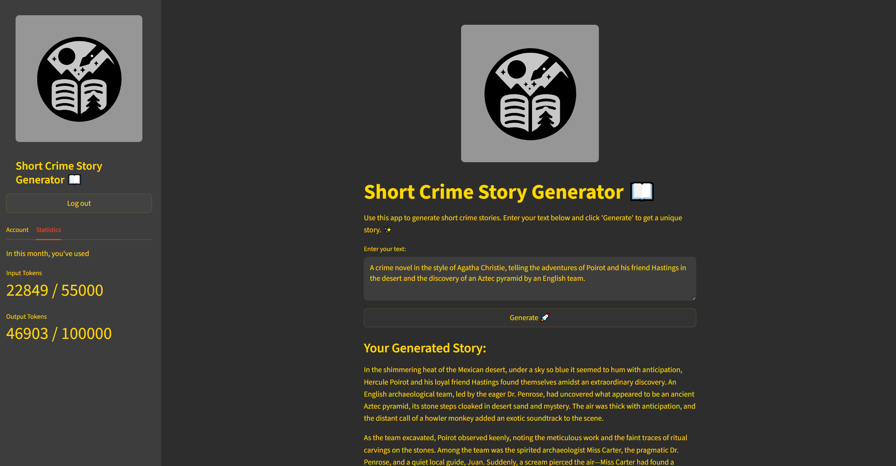

# Generator opowiadań 📖
<figure>
    </figcaption>" width="600">
</figure>
---
<a class="md-button md-button--primary" href="https://fairy-tale-generator-ab.streamlit.app/" target="_blank">Go to the application</a>

---
<!-- *Project start: 2025-04-05* -->

## Overview
A Streamlit-powered storytelling generator that creates engaging, structured short stories using OpenAI's language models, with user authentication, usage tracking, and tiered access based on subscription level.

<!-- ## Project architecture
	in Excalidraw -->

## Main functionalities
- Generates creative, structured short stories (with introduction, development, twist, and moral) from user-provided prompts
- Implements dynamic model rotation among multiple GPT models (e.g., `gpt-4o-mini`, `gpt-4.1-mini`)
- Tracks token usage per user and month with PostgreSQL
- Enforces usage limits: free users (1k input / 10k output tokens), premium users (10k input / 100k output tokens)
- Supports Google OAuth login and subscription management via `st_paywall`
- Provides real-time usage statistics and current model tracking in sidebar
- Allows downloading generated stories as plain text files

## Technologies & skills
- Python
- Streamlit
- OpenAI API
- PostgreSQL
- st_paywall (for user subscription management)
- Pandas (data handling)
- psycopg2 (PostgreSQL connector)
- itertools.cycle (for model rotation)

## Project Report
- Implemented token-based usage limits with monthly reset
- Integrated secure Google OAuth login and subscription tier detection
- Designed dynamic model selection to balance performance and cost
- Built robust error handling for unauthenticated users and usage overages
- Added real-time feedback via progress spinner and usage metrics
- Ensured data privacy by storing only necessary usage metadata

## Sample photos

<figure>
    </figcaption>" width="600">
<figcaption></figcaption>
    </figcaption>" width="600">
<figcaption></figcaption>
     </figcaption>" width="600">
<figcaption></figcaption>
    </figcaption>" width="600">
<figcaption></figcaption>
    </figcaption>" width="600">
<figcaption></figcaption>
    </figcaption>" width="600">
<figcaption></figcaption>
</figure>

Application usage
- Enter a prompt in the text area (e.g., "Zamieszkał w lesie stary człowiek...")
- Click "Generuj" to create a story
- View the generated story with model used and download option
- Monitor token usage in the sidebar
- Upgrade to premium for higher limits

---

<a class="md-button md-button--primary" href="https://fairy-tale-generator-ab.streamlit.app/" target="_blank">Go to the application</a>

---