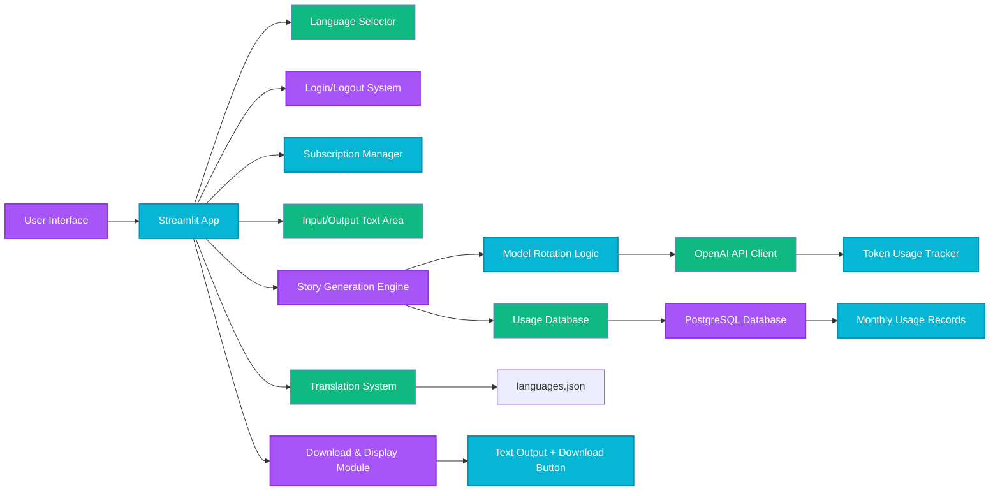

# Short Crime Story Generator 📖
<figure>
    </figcaption>" width="600">
</figure>
---
<a class="md-button md-button--primary" href="https://fairy-tale-generator-ab.streamlit.app/" target="_blank">Go to the application</a>

---

### ✅ 1. **Sequence Diagram: User Login & Story Generation Flow**

```mermaid
graph TD
    A[User Opens App] --> B{Is User Logged In?}
    B -- No --> C[Show Login Button]
    B -- Yes --> D[Show Sidebar: Language & Subscription]
    D --> E[User Selects Language]
    E --> F[User Enters Prompt Text]
    F --> G[User Clicks "Generate"]
    G --> H[App Validates Usage Limits]
    H --> I{Free User?}
    I -- Yes --> J[Check Monthly Token Limits]
    I -- No --> K[Premium User: Unlimited (Premium Tier)]
    J --> L{Exceeded Limits?}
    L -- Yes --> M[Show Error: Usage Exceeded]
    L -- No --> N[App Selects Next Model (gpt-4.1-nano)]
    N --> O[Send Prompt to OpenAI via API]
    O --> P[Receive Generated Story]
    P --> Q[Save Usage to Database]
    Q --> R[Display Story + Download Button]
    R --> S[User Can Download or Exit]
```

**Styles (as per your example):**
```mermaid
style A fill:#A855F7,stroke:#9333EA,stroke-width:2px,color:#fff
style B fill:#06B6D4,stroke:#0891B2,stroke-width:2px,color:#fff
style C fill:#10B981,color:#fff
style D fill:#A855F7,stroke:#9333EA,stroke-width:2px,color:#fff
style E fill:#06B6D4,stroke:#0891B2,stroke-width:2px,color:#fff
style F fill:#10B981,color:#fff
style G fill:#A855F7,stroke:#9333EA,stroke-width:2px,color:#fff
style H fill:#06B6D4,stroke:#0891B2,stroke-width:2px,color:#fff
style I fill:#10B981,color:#fff
style J fill:#06B6D4,stroke:#0891B2,stroke-width:2px,color:#fff
style K fill:#10B981,color:#fff
style L fill:#06B6D4,stroke:#0891B2,stroke-width:2px,color:#fff
style M fill:#10B981,color:#fff
style N fill:#A855F7,stroke:#9333EA,stroke-width:2px,color:#fff
style O fill:#06B6D4,stroke:#0891B2,stroke-width:2px,color:#fff
style P fill:#10B981,color:#fff
style Q fill:#A855F7,stroke:#9333EA,stroke-width:2px,color:#fff
style R fill:#06B6D4,stroke:#0891B2,stroke-width:2px,color:#fff
style S fill:#10B981,color:#fff
```

---

### ✅ 2. **Component Diagram: App Architecture**



---

### ✅ 3. **Flowchart: Approval Process (for Premium Upgrade)**

> This simulates a simplified "user requests premium" approval flow (e.g., via subscription button).

```mermaid
graph TD
    A[User Clicks "Become Premium"] --> B[Check Current Subscription]
    B -- Not Subscribed --> C[Redirect to Payment Gateway]
    C --> D[User Pays via Stripe / PayPal]
    D --> E{Payment Successful?}
    E -- Yes --> F[Mark as Premium User]
    E -- No --> G[Show Error: Payment Failed]
    F --> H[Update DB: user_subscribed = True]
    H --> I[Show Premium Status in Sidebar]
    I --> J[Allow Unlimited Tokens]
    G --> K[Display Error Message]

    style A fill:#A855F7,stroke:#9333EA,stroke-width:2px,color:#fff
    style B fill:#06B6D4,stroke:#0891B2,stroke-width:2px,color:#fff
    style C fill:#10B981,color:#fff
    style D fill:#A855F7,stroke:#9333EA,stroke-width:2px,color:#fff
    style E fill:#06B6D4,stroke:#0891B2,stroke-width:2px,color:#fff
    style F fill:#10B981,color:#fff
    style G fill:#A855F7,stroke:#9333EA,stroke-width:2px,color:#fff
    style H fill:#06B6D4,stroke:#0891B2,stroke-width:2px,color:#fff
    style I fill:#10B981,color:#fff
    style J fill:#06B6D4,stroke:#0891B2,stroke-width:2px,color:#fff
    style K fill:#10B981,color:#fff
```
<!-- *Project start: 2025-04-05* -->

## Overview
A Streamlit-powered storytelling generator that creates engaging, structured short stories using OpenAI's language models, with user authentication, usage tracking, and tiered access based on subscription level.

<!-- ## Project architecture
	in Excalidraw -->

## Main functionalities
- Generates creative, structured short stories (with introduction, development, twist, and moral) from user-provided prompts
- Implements dynamic model rotation among multiple GPT models (e.g., `gpt-4o-mini`, `gpt-4.1-mini`)
- Tracks token usage per user and month with PostgreSQL
- Enforces usage limits: free users (1k input / 10k output tokens), premium users (10k input / 100k output tokens)
- Supports Google OAuth login and subscription management via `st_paywall`
- Provides real-time usage statistics and current model tracking in sidebar
- Allows downloading generated stories as plain text files

## Technologies & skills
- Python
- Streamlit
- OpenAI API
<!-- - PostgreSQL -->
- Create and deploy databases PostgreSQL on Ubuntu server https://cloud.digitalocean.com/droplets?i=0c32ac
- st_paywall (for user subscription management)
- Pandas (data handling)
- psycopg2 (PostgreSQL connector)
- itertools.cycle (for model rotation)

## Project Report
- Implemented token-based usage limits with monthly reset
- Integrated secure Google OAuth login and subscription tier detection
- Designed dynamic model selection to balance performance and cost
- Built robust error handling for unauthenticated users and usage overages
- Added real-time feedback via progress spinner and usage metrics
- Ensured data privacy by storing only necessary usage metadata

## Sample photos

<figure>
    </figcaption>" width="600">
<figcaption></figcaption>
    </figcaption>" width="600">
<figcaption></figcaption>
     </figcaption>" width="600">
<figcaption></figcaption>
    </figcaption>" width="600">
<figcaption></figcaption>
    </figcaption>" width="600">
<figcaption></figcaption>
    </figcaption>" width="600">
<figcaption></figcaption>
</figure>

## Application usage

- Enter a prompt in the text area 
- Click "Generate" to create a story
- View the generated story with model used and download option
- Monitor token usage in the sidebar
- Upgrade to premium for higher limits

---

<a class="md-button md-button--primary" href="https://fairy-tale-generator-ab.streamlit.app/" target="_blank">Go to the application</a>

---