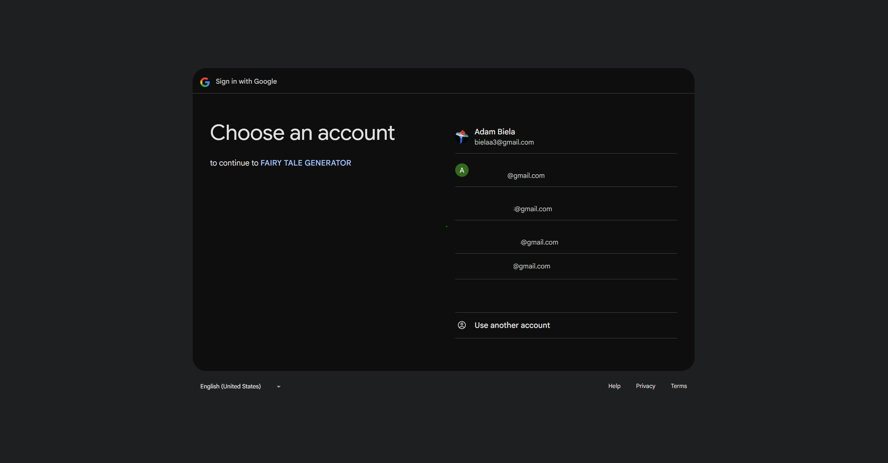

# Short Crime Story Generator 📖
<figure>
    </figcaption>" width="600">
</figure>
---
<a class="md-button md-button--primary" href="https://fairy-tale-generator-ab.streamlit.app/" target="_blank">Go to the application</a>

---

## ✅ 1. **Sequence Diagram: User Login & Story Generation Flow**

This shows the key user flow — from login to generating a story.

```mermaid
sequenceDiagram
    participant User
    participant App
    participant Database
    participant OpenAI
    participant AuthSystem

    User->>App: Clicks "Login" (via sidebar)
    App->>AuthSystem: Validate credentials
    AuthSystem-->>App: Returns success/failure
    alt Login successful
        App->>App: Set user session (email, language, subscription)
        App->>App: Load translations (languages.json)
        User->>App: Enters text in input box
        App->>App: Check usage limits (input/output tokens)
        alt Free user
            App->>App: Validate monthly limits
            User->>App: Clicks "Generate Story"
            App->>App: Select next model (gpt-4.1-nano)
            App->>OpenAI: Send prompt to generate story
            OpenAI-->>App: Returns generated story with usage data
            App->>Database: Log input/output tokens
            App-->>User: Display story and download button
        else Premium user
            App->>App: Allow full token usage
            User->>App: Clicks "Generate Story"
            App->>OpenAI: Send prompt to generate story
            OpenAI-->>App: Returns generated story with usage data
            App->>Database: Log input/output tokens
            App-->>User: Display story and download button
    end
    User->>App: Clicks "Logout"
    App->>App: Clear session
```

---

## ✅ 2. **Component Diagram: Application Architecture**

This shows the modular components and their relationships.

```mermaid
componentDiagram
    [Streamlit App] --> [User Interface]
    [User Interface] --> [Authentication Layer]
    [User Interface] --> [Translation Manager]
    [User Interface] --> [Usage Limit Checker]
    [User Interface] --> [OpenAI API Client]
    [User Interface] --> [Database Layer (PostgreSQL)]
    [Database Layer] --> [usages table]
    [Database Layer] --> [user_profiles table]

    [Authentication Layer] --> [Google OAuth]
    [Translation Manager] --> [languages.json]
    [OpenAI API Client] --> [OpenAI API]
    [Usage Limit Checker] --> [FREE / PREMIUM limits]
    [OpenAI API Client] --> [Model Rotation (gpt-4.1-nano)]

    note right of [User Interface]
        Main entry point for users
        Handles routing, UI, state management
    end

    note right of [Authentication Layer]
        Manages login/logout and user session
        Uses Google OAuth
    end

    note right of [Translation Manager]
        Loads and switches between languages (en/pl)
        Uses JSON config file
    end

    note right of [Usage Limit Checker]
        Tracks monthly token usage
        Blocks free users at 2500 input / 3000 output
    end

    note right of [OpenAI API Client]
        Dynamically selects model (cycle through list)
        Sends prompts and receives responses
    end

    note right of [Database Layer]
        Stores user sessions, usage logs
        Ensures audit trail and quota tracking
    end
```

---

## ✅ 3. **Flowchart: Approval Process (Decision Logic for Usage Limits)**

This illustrates how the app decides whether to allow or block a story generation based on user type and usage.

```mermaid
flowchart TD
    A[User logs in] --> B{Is user logged in?}
    B -- No --> C[Redirect to login]
    B -- Yes --> D{Is user premium?}
    D -- No --> E[Check monthly input tokens]
    E --> F{≥ 2500 input tokens?}
    F -- Yes --> G[Block request: Usage limit exceeded]
    F -- No --> H{≥ 3000 output tokens?}
    H -- Yes --> I[Block request: Usage limit exceeded]
    H -- No --> J[Allow generation]
    D -- Yes --> K[Check monthly input/output tokens]
    K --> L{≥ 100k input/output tokens?}
    L -- Yes --> M[Block request: Premium limit exceeded]
    L -- No --> J[Allow generation]

    style A fill:#f9f,stroke:#333
    style C fill:#f9f,stroke:#333
    style D fill:#f9f,stroke:#333
    style E fill:#cfc,stroke:#333
    style F fill:#cfc,stroke:#333
    style G fill:#f9f,stroke:#333
    style H fill:#cfc,stroke:#333
    style I fill:#f9f,stroke:#333
    style J fill:#cfc,stroke:#333
    style K fill:#cfc,stroke:#333
    style L fill:#cfc,stroke:#333
    style M fill:#f9f,stroke:#333

    classDef default fill:#f9f,stroke:#333,stroke-width:2px;
    classDef warning fill:#f9f,stroke:#333;
    classDef allowed fill:#cfc,stroke:#333;
```


<!-- *Project start: 2025-04-05* -->

## Overview
A Streamlit-powered storytelling generator that creates engaging, structured short stories using OpenAI's language models, with user authentication, usage tracking, and tiered access based on subscription level.

<!-- ## Project architecture
	in Excalidraw -->

## Main functionalities
- Generates creative, structured short stories (with introduction, development, twist, and moral) from user-provided prompts
- Implements dynamic model rotation among multiple GPT models (e.g., `gpt-4o-mini`, `gpt-4.1-mini`)
- Tracks token usage per user and month with PostgreSQL
- Enforces usage limits: free users (1k input / 10k output tokens), premium users (10k input / 100k output tokens)
- Supports Google OAuth login and subscription management via `st_paywall`
- Provides real-time usage statistics and current model tracking in sidebar
- Allows downloading generated stories as plain text files

## Technologies & skills
- Python
- Streamlit
- OpenAI API
<!-- - PostgreSQL -->
- Create and deploy databases PostgreSQL on Ubuntu server https://cloud.digitalocean.com/droplets?i=0c32ac
- st_paywall (for user subscription management)
- Pandas (data handling)
- psycopg2 (PostgreSQL connector)
- itertools.cycle (for model rotation)

## Project Report
- Implemented token-based usage limits with monthly reset
- Integrated secure Google OAuth login and subscription tier detection
- Designed dynamic model selection to balance performance and cost
- Built robust error handling for unauthenticated users and usage overages
- Added real-time feedback via progress spinner and usage metrics
- Ensured data privacy by storing only necessary usage metadata

## Sample photos

<figure>
    </figcaption>" width="600">
<figcaption></figcaption>
    </figcaption>" width="600">
<figcaption></figcaption>
     </figcaption>" width="600">
<figcaption></figcaption>
    </figcaption>" width="600">
<figcaption></figcaption>
    </figcaption>" width="600">
<figcaption></figcaption>
    </figcaption>" width="600">
<figcaption></figcaption>
</figure>

## Application usage

- Enter a prompt in the text area 
- Click "Generate" to create a story
- View the generated story with model used and download option
- Monitor token usage in the sidebar
- Upgrade to premium for higher limits

---

<a class="md-button md-button--primary" href="https://fairy-tale-generator-ab.streamlit.app/" target="_blank">Go to the application</a>

---