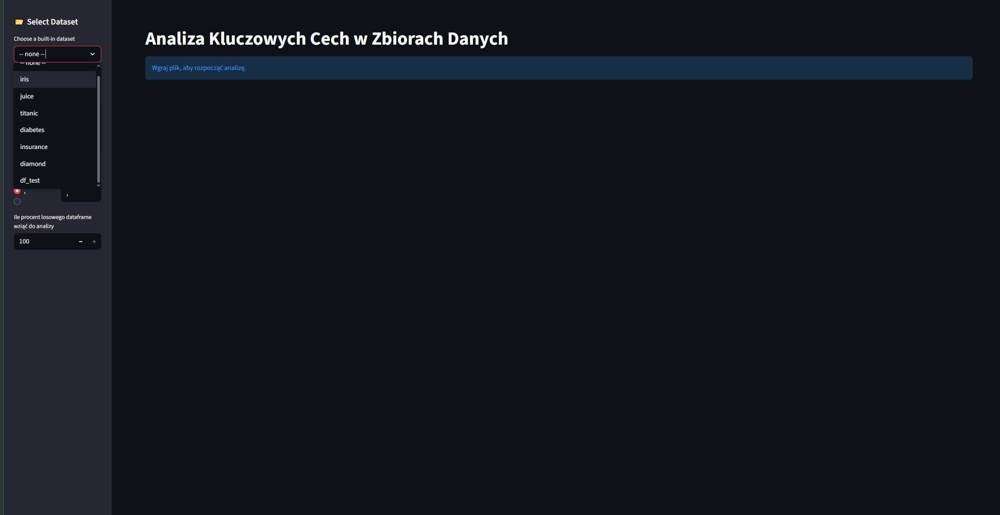
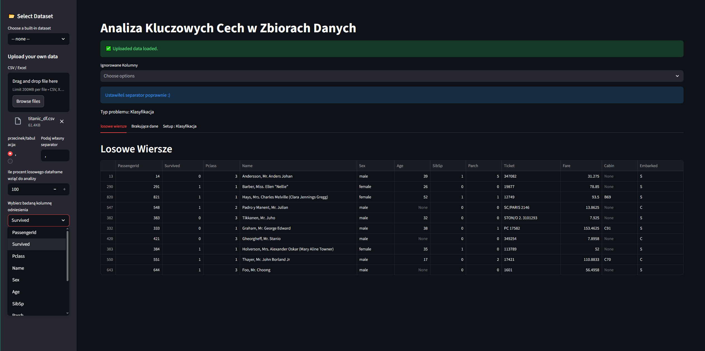
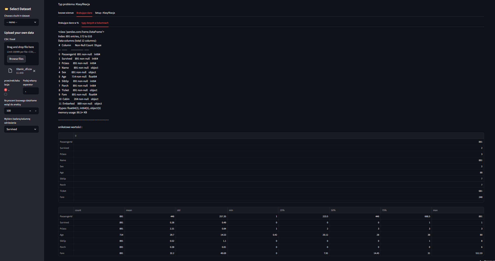
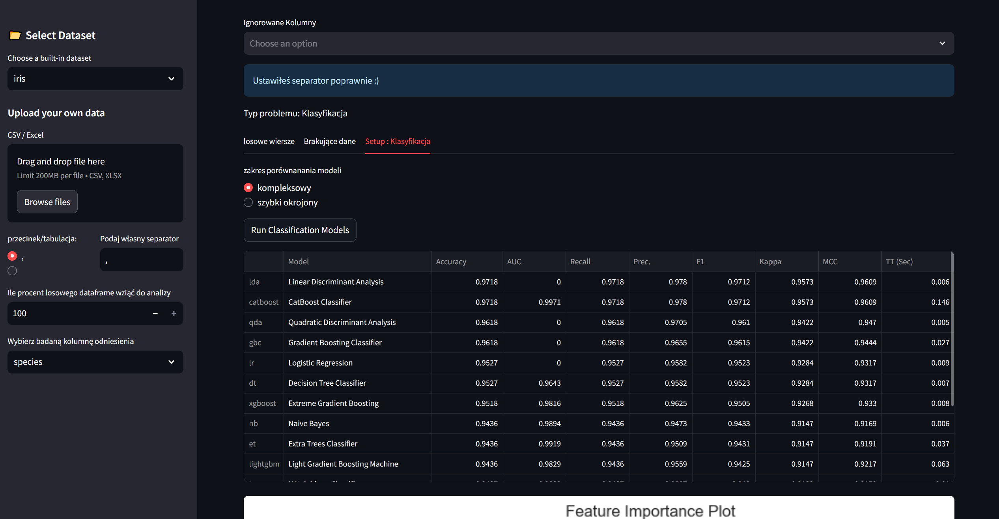
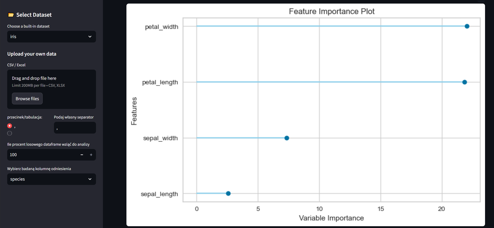
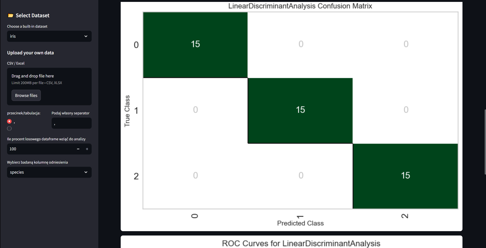
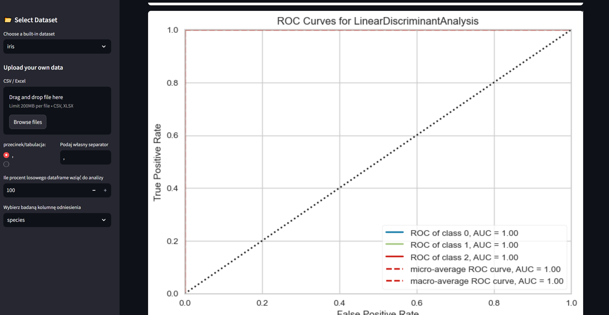

# Analysis_of_Key_Variables_in_Data_Sets

## Overview
Interactive Streamlit app that loads a user‑supplied dataset, automatically detects whether the target column is for classification or regression, and runs PyCaret experiments to compare models, visualize feature importance, confusion matrices, and ROC curves.
<!-- 
## Project architecture
	in Excalidraw -->

## Main functionalities
- Upload CSV/JSON/XLSX files with custom separator selection.
- Random sampling of a user‑defined percentage of the dataframe for training.
- Automatic detection of problem type (classification vs regression).
- Interactive tabs: random rows, missing data analysis, and model setup.
- PyCaret **ClassificationExperiment** or **RegressionExperiment** setup with options to ignore columns, balance classes, normalize, and transform features.
- Model comparison (**compare_models**) with selectable model sets.
- Generation of feature importance plots, confusion matrices, and ROC curves.
- Save and load pre‑generated plot images for later use.

## Technologies & skills
- Python 3.x
- Streamlit
- Pandas, NumPy
- PyCaret (classification, regression)
- Matplotlib, Seaborn
- Scikit‑learn metrics

## Project Report
- The app demonstrates end‑to‑end machine learning workflow: data ingestion → preprocessing → model training → evaluation.
- It is designed for non‑technical users to quickly assess which algorithm works best on their dataset.

## Sample photos

<figure>
    built‑in dataset</figcaption>" width="600">
<figcaption>built‑in dataset</figcaption>
    you can load your own data in the initial setup</figcaption>" width="600">
<figcaption>you can load your own data in the initial setup</figcaption>
    preliminary data analysis</figcaption>" width="600">
<figcaption>preliminary data analysis</figcaption>
    detection of a problem and model comparison range</figcaption>" width="600">
<figcaption>detection of a problem and model comparison range</figcaption>
    Feature Importance</figcaption>" width="600">
<figcaption>Feature Importance</figcaption>
    Confusion Matrix</figcaption>" width="600">
<figcaption>Confusion Matrix</figcaption>
    ROC Curves</figcaption>" width="600">
<figcaption>ROC Curves</figcaption>
</figure>

## Application usage
- Upload a dataset.
- Choose separator and target column.
- Inspect random rows and missing data.
- Run model comparison and view evaluation plots.

---
<a class="md-button md-button--primary" href="https://analysis-of-key-variables-in-data-sets.streamlit.app/" target="_blank">Go to the application</a>
---