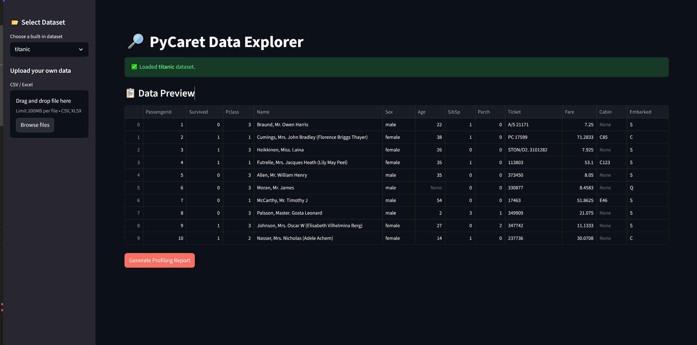
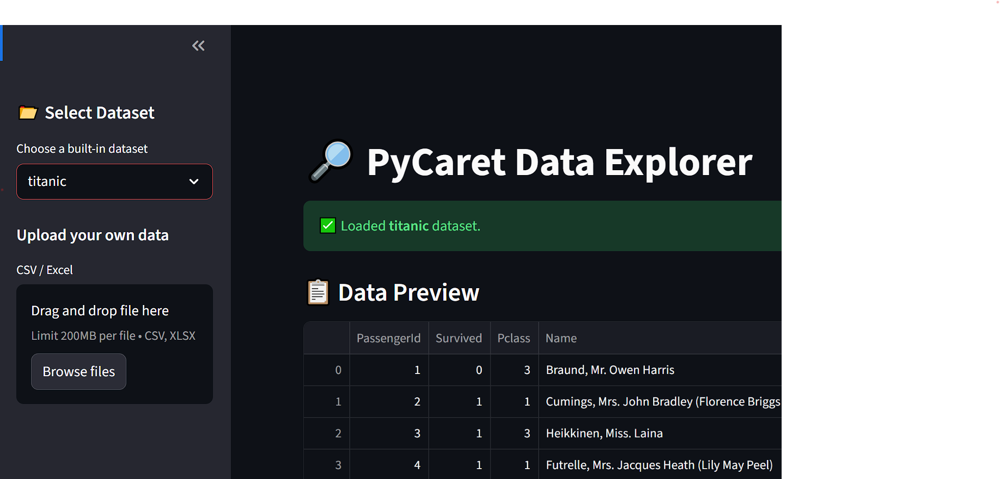
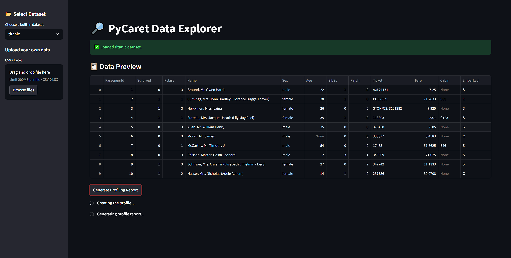
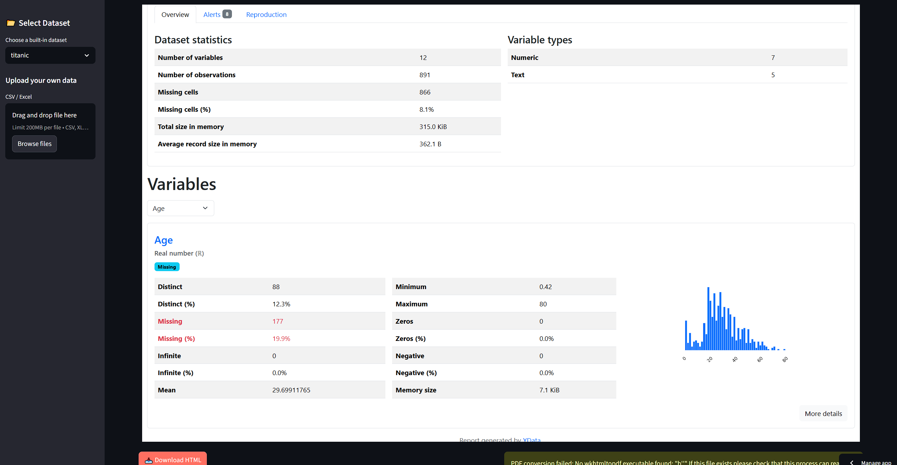
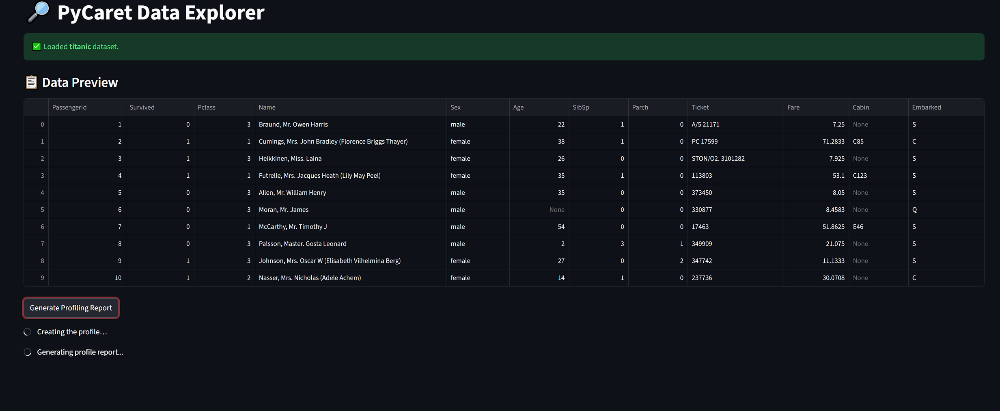
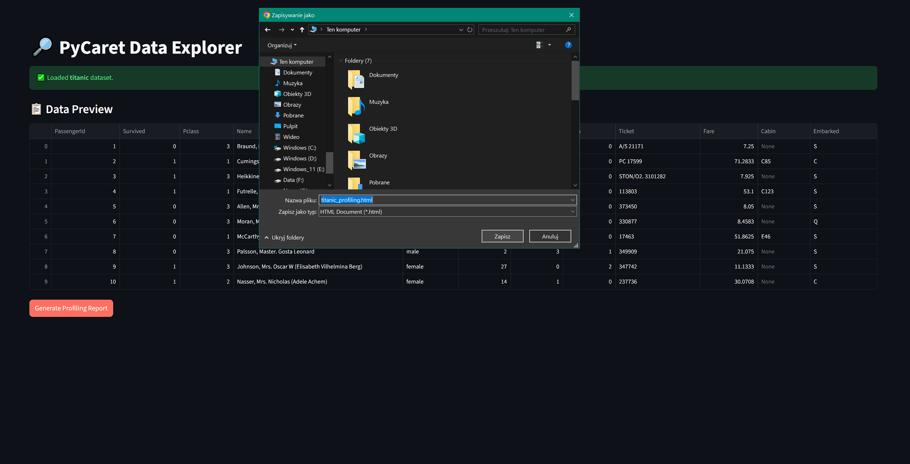
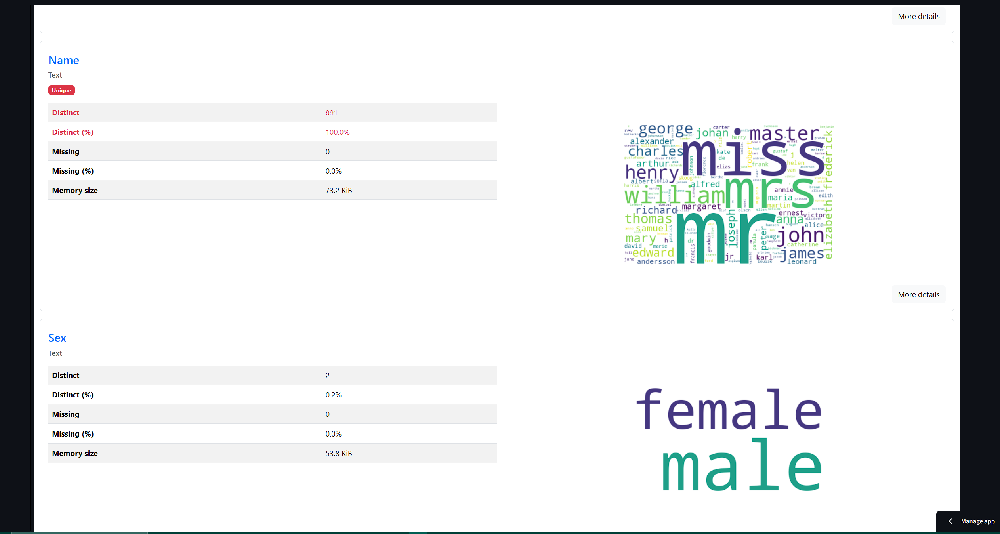

<!-- # Streamlit Data Explorer – PyCaret + ydata‑profiling -->
---
<a class="md-button md-button--primary" href="https://dataexplorer-pycaret.streamlit.app/" target="_blank">Go to the application</a>
---
## Overview
A lightweight Streamlit app that lets users load built-in or custom datasets and generate interactive data profiling reports using PyCaret and ydata‑profiling.

<!-- ## Project architecture
    in Excalidraw -->

## Main functionalities
- Select a dataset from the list of built‑in PyCaret datasets via sidebar.
- Upload CSV / Excel files for analysis.
- Preview the first rows of the selected dataset.
- Generate an interactive profiling report with ydata‑profiling.
- Export the report as HTML or PDF (PDF conversion uses pdfkit/wkhtmltopdf).
- Dark themed UI and responsive layout.

## Technologies & skills
- Python
- Streamlit
- Pandas
- PyCaret datasets
- ydata‑profiling
- streamlit‑pandas‑profiling
- pdfkit / wkhtmltopdf (optional)

## Project Report
- Profiling report generation and export functionality.
- User-friendly interface for data exploration.

## Sample photos

<figure>
    Pic_name</figcaption>" width="600">
<!-- <figcaption>Pic_name</figcaption> -->
    Pic_name2</figcaption>" width="600">
<!-- <figcaption>Pic_name2</figcaption> -->
    Pic_name3</figcaption>" width="600">
<!-- <figcaption>Pic_name3</figcaption> -->
    Pic_name4</figcaption>" width="600">
<!-- <figcaption>Pic_name5</figcaption> -->
    Pic_name4</figcaption>" width="600">
<!-- <figcaption>Pic_name5</figcaption> -->
    Pic_name4</figcaption>" width="600">
    Pic_name4</figcaption>" width="600">
<!-- <figcaption>Pic_name5</figcaption> -->
<!-- <figcaption>Pic_name5</figcaption> -->
</figure>

## Application usage
<!-- - Run the app locally with `streamlit run app.py`. -->
- Use the sidebar to choose a dataset or upload your own file.
- Click "Generate Profiling Report" to view and download the report.

---
<a class="md-button md-button--primary" href="https://dataexplorer-pycaret.streamlit.app/" target="_blank">Go to the application</a>
---