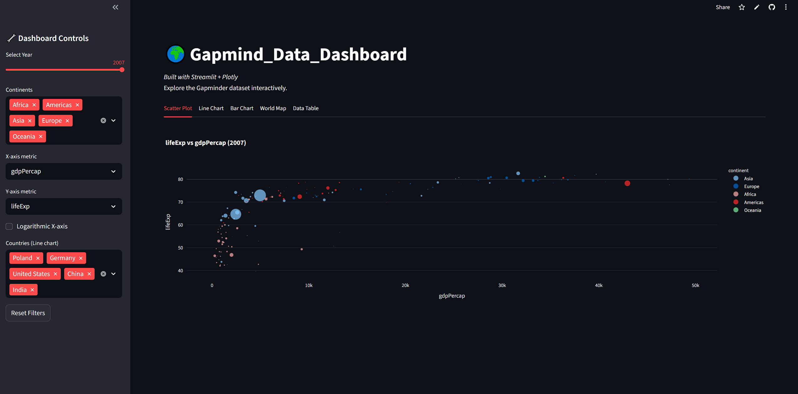
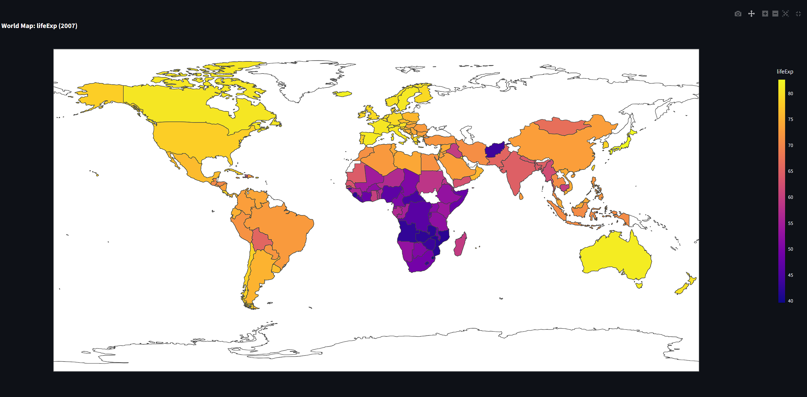
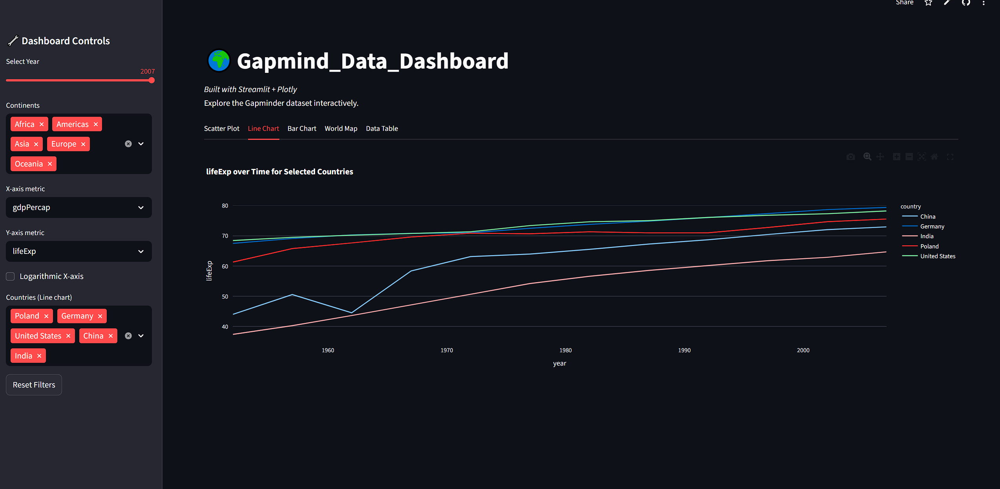

# Gapmind Data Dashboard

## Overview
Interactive dashboard that visualizes the Gapminder dataset using Streamlit and Plotly Express.

<!-- ## Project architecture
    in Excalidraw -->
## Main functionalities
- Year selector slider to choose the analysis year.
- Continent multiselect filter for country selection.
- X‑axis and Y‑axis metric selectors for scatter plots.
- Toggle for logarithmic scaling of the X‑axis.
- Country multiselect for time‑series line charts.
- Reset filters button to restore defaults.
- Scatter plot visualizing GDP per capita, life expectancy, or population across continents.
- Line chart showing selected metrics over time for chosen countries.
- Bar chart displaying top N countries by a chosen metric in the selected year.
- World choropleth map coloring countries by the selected metric.
- Data table view of the filtered dataset with CSV download capability.

## Technologies & skills
- Python
- Streamlit
- Plotly Express
- Pandas
<!-- 
## Project Report
- -->

## Sample photos

<figure>
    Gapminder Scatter Plot</figcaption>" width="600">
<figcaption>Gapminder Scatter Plot</figcaption>
    Gapminder Line Chart</figcaption>" width="600">
<figcaption>Gapminder Line Chart</figcaption>
    Gapminder Bar Chart</figcaption>" width="600">
<figcaption>Gapminder Bar Chart</figcaption>
    <!-- Gapminder World Map</figcaption>" width="600">
<figcaption>Gapminder World Map</figcaption> -->
</figure>

## Application usage
-

--- 
<a class="md-button md-button--primary" href="https://gapmind-data-dashboard.streamlit.app/" target="_blank">Go to the application</a>
---