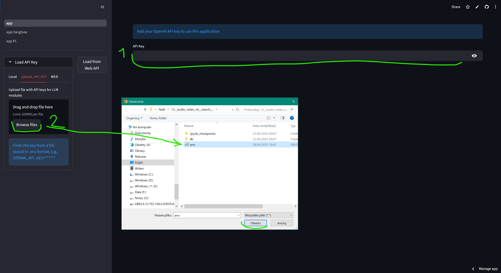
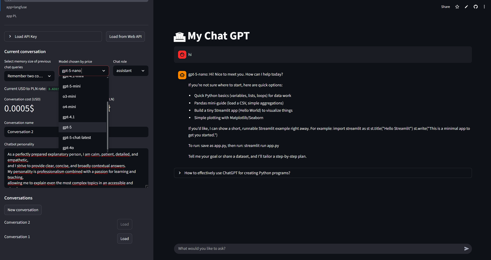
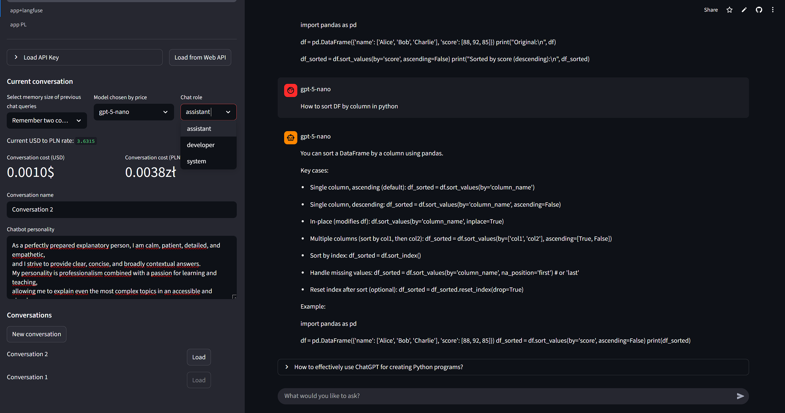
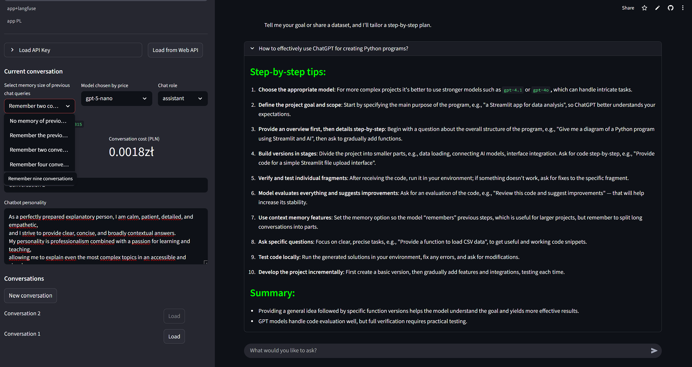

# My Chat GPT

## Overview
A Streamlit web application that provides an interactive chat interface with OpenAI GPT models, supporting memory management, cost tracking, and persistent conversation storage.

<!-- ## Project architecture
    in Excalidraw -->

## Main functionalities
- Interactive chat interface using Streamlit.  
- Selection of conversation memory size to control context length.  
- Choice of GPT model from a predefined set with pricing.  
- Role selection for the chatbot (assistant, developer, system).  
- Persistent storage of conversations as JSON files on local disk.  
- Customizable chatbot personality via text area.  
- Real‑time cost calculation in USD and PLN based on token usage.  
- Display of current USD/PLN exchange rate fetched from an API.  
- Ability to create new conversations or switch between existing ones.  
- Help section with step‑by‑step tips for using ChatGPT to build Python programs.

## Technologies & skills
- Python  
- Streamlit  
- OpenAI API (openai library)  
- dotenv  
- requests  
- pathlib / json  

## Project Report
- Completed functional chat application with persistent storage and cost tracking.

## Sample photos

<figure>
    Two ways of entering API_KEY</figcaption>" width="600">
<figcaption>Two ways of entering API_KEY</figcaption>
    Model_chose</figcaption>" width="600">
<figcaption>Model_chose</figcaption>
    Chat_role</figcaption>" width="600">
<figcaption>Chat_role</figcaption>
    Chat memory & Tips</figcaption>" width="600">
<figcaption>Chat memory & Tips</figcaption>
</figure>

## Application usage
- Open the Streamlit app in a browser.    
- Configure conversation memory, model, and role in the sidebar.  
- Enter prompts into the chat input to interact with GPT.  
- Monitor cost metrics (USD/PLN) on the sidebar.  
- Manage conversations: rename, create new, load existing.

### <span style='color: #00FF00;'>Where to get API key and addresses?</span>

1. **OpenAI API Key (openai_api_key):**  
   - Visit the [OpenAI API Keys page](https://platform.openai.com/account/api-keys).  
   - Log in to your account or create a new one.  
   - Click "Create API key" and copy the key.
### <span style='color: #00FF00;'>Example configuration file:</span>

```plaintext
OPENAI_API_KEY=your-openai-api-key

```

---
<a class="md-button md-button--primary" href="https://chat-gpt-adambiela.streamlit.app/">Przejdź do aplikacji</a>
---