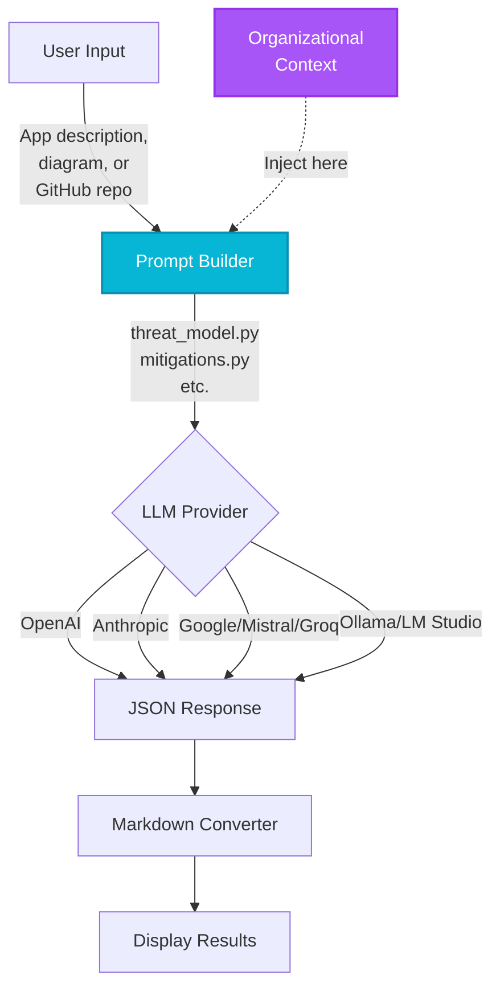
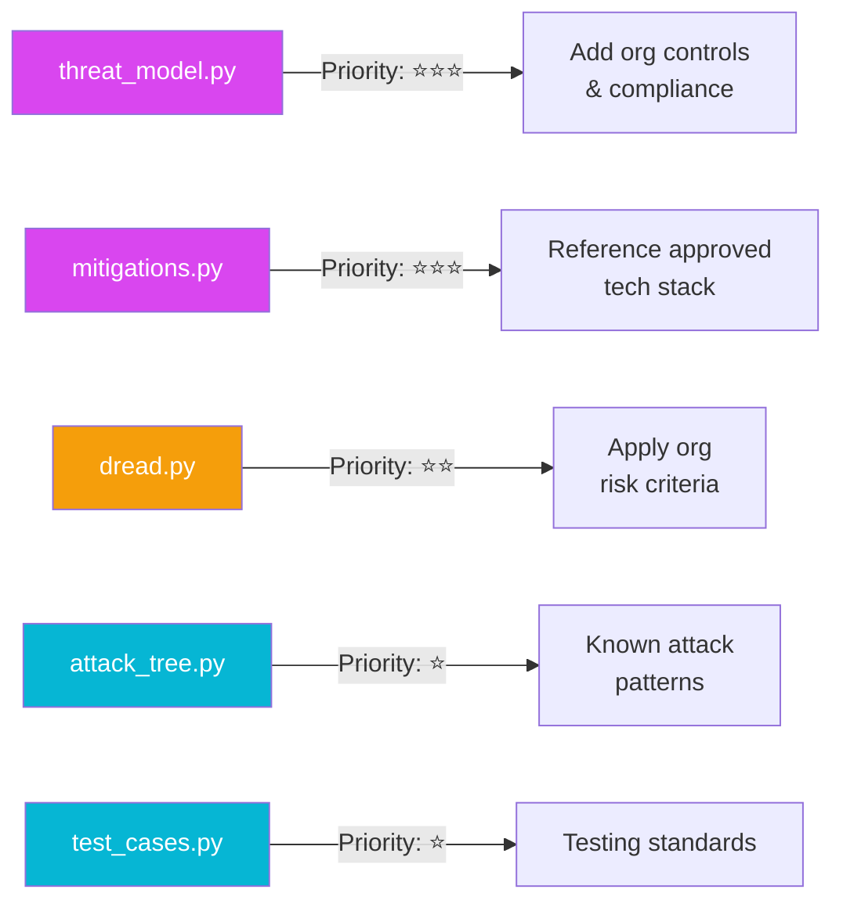
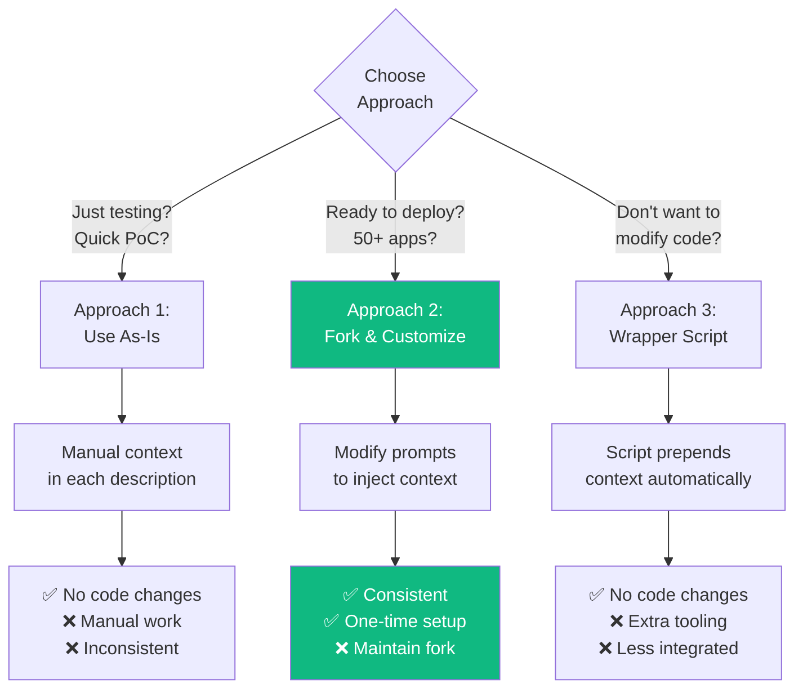
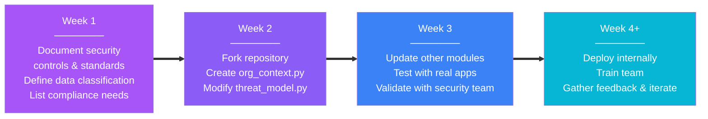
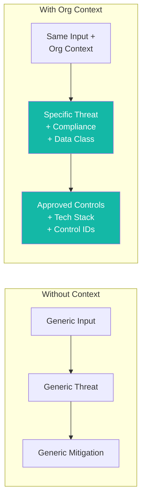
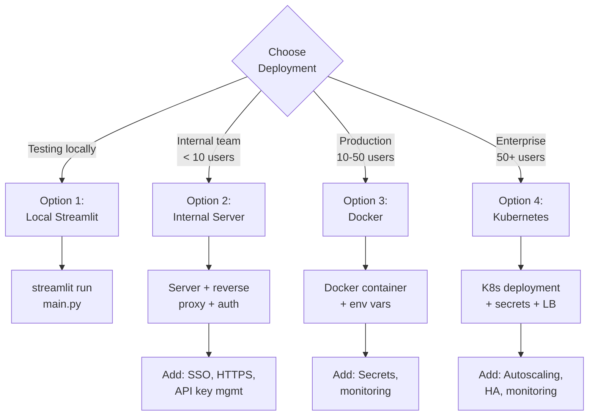

```mermaid
flowchart TD
    A[User Input] -->|App description,<br/>diagram, or<br/>GitHub repo| B[Prompt Builder]
    B -->|threat_model.py<br/>mitigations.py<br/>etc.| C{LLM Provider}
    C -->|OpenAI| D[JSON Response]
    C -->|Anthropic| D
    C -->|Google/Mistral/Groq| D
    C -->|Ollama/LM Studio| D
    D --> E[Markdown Converter]
    E --> F[Display Results]

    G[Organizational<br/>Context] -.->|Inject here| B

    style G fill:#A855F7,stroke:#9333EA,stroke-width:2px,color:#fff
    style B fill:#06B6D4,stroke:#0891B2,stroke-width:2px,color:#fff
```

### Current Customization Points

```mermaid
graph LR
    A[threat_model.py] -->|Priority: ⭐⭐⭐| B[Add org controls<br/>& compliance]
    C[mitigations.py] -->|Priority: ⭐⭐⭐| D[Reference approved<br/>tech stack]
    E[dread.py] -->|Priority: ⭐⭐| F[Apply org<br/>risk criteria]
    G[attack_tree.py] -->|Priority: ⭐| H[Known attack<br/>patterns]
    I[test_cases.py] -->|Priority: ⭐| J[Testing standards]

    style A fill:#D946EF,color:#fff
    style C fill:#D946EF,color:#fff
    style E fill:#F59E0B,color:#fff
    style G fill:#06B6D4,color:#fff
    style I fill:#06B6D4,color:#fff
```

## Three Approaches to Using app

```mermaid
graph TD
    Start{Choose<br/>Approach}

    Start -->|Just testing?<br/>Quick PoC?| A1[Approach 1:<br/>Use As-Is]
    Start -->|Ready to deploy?<br/>50+ apps?| A2[Approach 2:<br/>Fork & Customize]
    Start -->|Don't want to<br/>modify code?| A3[Approach 3:<br/>Wrapper Script]

    A1 --> B1[Manual context<br/>in each description]
    A2 --> B2[Modify prompts<br/>to inject context]
    A3 --> B3[Script prepends<br/>context automatically]

    B1 --> C1[✅ No code changes<br/>❌ Manual work<br/>❌ Inconsistent]
    B2 --> C2[✅ Consistent<br/>✅ One-time setup<br/>❌ Maintain fork]
    B3 --> C3[✅ No code changes<br/>❌ Extra tooling<br/>❌ Less integrated]

    style A2 fill:#10B981,color:#fff
    style C2 fill:#10B981,color:#fff
```

### Implementation Roadmap

```mermaid
graph LR
    W1[Week 1<br/>───────<br/>Document security<br/>controls & standards<br/>Define data classification<br/>List compliance needs]
    W2[Week 2<br/>───────<br/>Fork repository<br/>Create org_context.py<br/>Modify threat_model.py]
    W3[Week 3<br/>───────<br/>Update other modules<br/>Test with real apps<br/>Validate with security team]
    W4[Week 4+<br/>───────<br/>Deploy internally<br/>Train team<br/>Gather feedback & iterate]

    W1 ==> W2 ==> W3 ==> W4

    style W1 fill:#A855F7,color:#fff
    style W2 fill:#8B5CF6,color:#fff
    style W3 fill:#3B82F6,color:#fff
    style W4 fill:#06B6D4,color:#fff
```

### Impact of Organizational Context

```mermaid
graph LR
    subgraph "Without Context"
    A1[Generic Input] --> B1[Generic Threat]
    B1 --> C1[Generic Mitigation]
    end

    subgraph "With Org Context"
    A2[Same Input +<br/>Org Context] --> B2[Specific Threat<br/>+ Compliance<br/>+ Data Class]
    B2 --> C2[Approved Controls<br/>+ Tech Stack<br/>+ Control IDs]
    end

    style B2 fill:#14B8A6,color:#fff
    style C2 fill:#14B8A6,color:#fff
```

## Deployment Options

```mermaid
graph TD
    Start{Choose<br/>Deployment}

    Start -->|Testing locally| D1[Option 1:<br/>Local Streamlit]
    Start -->|Internal team<br/>< 10 users| D2[Option 2:<br/>Internal Server]
    Start -->|Production<br/>10-50 users| D3[Option 3:<br/>Docker]
    Start -->|Enterprise<br/>50+ users| D4[Option 4:<br/>Kubernetes]

    D1 --> E1[streamlit run<br/>main.py]
    D2 --> E2[Server + reverse<br/>proxy + auth]
    D3 --> E3[Docker container<br/>+ env vars]
    D4 --> E4[K8s deployment<br/>+ secrets + LB]

    E2 --> F2[Add: SSO, HTTPS,<br/>API key mgmt]
    E3 --> F3[Add: Secrets,<br/>monitoring]
    E4 --> F4[Add: Autoscaling,<br/>HA, monitoring]
```