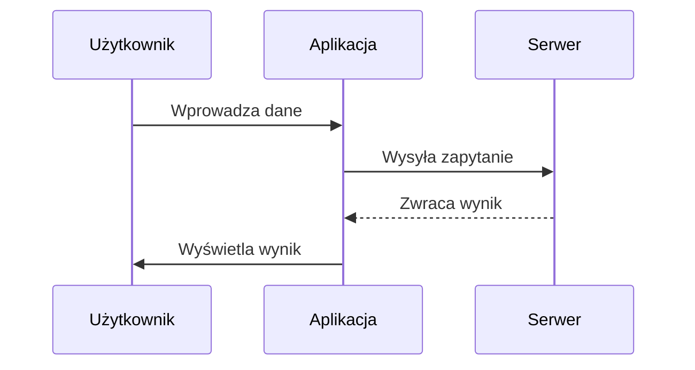
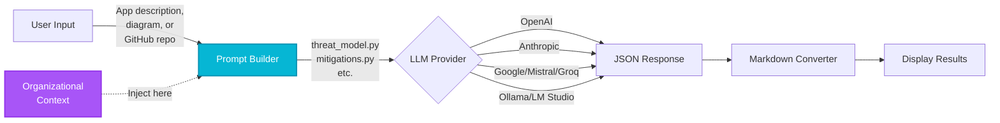

# Presentation of Diagrams

## PlantUML Diagrams

(Paste PlantUML code here)

## Graphviz Network Diagram

(Paste Graphviz DOT code here)

## Blockly Flow Diagram

(Paste Blockly code here - optional)

# Prezentacja Możliwości Diagramów i Wykresów

## 1. Mermaid

### Diagram Sekwencyjny (Sequence Diagram)

