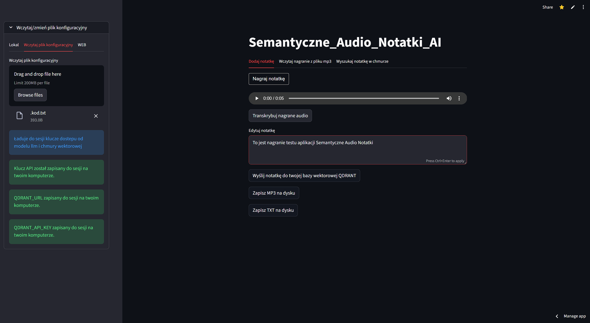

## Overview
A Streamlit web application that records or uploads audio notes, transcribes them using OpenAI’s Whisper model, embeds the text with OpenAI embeddings, stores the notes in Qdrant for semantic search, and allows editing, downloading, and searching of notes.

## Main functionalities
- Record audio directly from the browser.
- Upload existing MP3 files.
- Transcribe audio to text via OpenAI Whisper.
- Edit transcribed notes in a text area.
- Save notes with embeddings into a Qdrant vector database.
- Perform semantic search on stored notes using embeddings.
- Download notes as MP3 or TXT files.

## Technologies & skills
- Python  
- Streamlit  
- audiorecorder (web recording)  
- OpenAI API (Whisper, Embeddings)  
- Qdrant vector database  
- dotenv for environment variables  
- hashlib md5 for audio change detection  
- st_paywall for authentication  
- Custom modules: `my_package.tips`, `api_key_loader_zmiany`  

## Project Report
- Utilizes Streamlit session state to persist audio and text across interactions.
- MD5 hashing detects changes in recorded audio to reset transcriptions.
- Caches OpenAI and Qdrant clients for efficient reuse.
- Ensures the Qdrant collection exists before inserting notes.
- Supports both real-time recording and file upload workflows.

## Sample photos  
 
  
 

...

Application usage
- Open the Streamlit app in a browser.  
- Navigate to the “Dodaj notatkę” tab to record a new audio note or to the “Wczytaj nagranie z pliku mp3” tab to upload an existing MP3.  
- Click **Transkrybuj** to convert the audio into text.  
- Edit the transcribed text if needed, then click **Wyślij notatkę do twojej bazy wektorowej QDRANT** to store it.  
- Use the “Wyszukaj notatkę w chmurze” tab to perform a semantic search by entering a query; relevant notes and similarity scores will appear.

---

<a class="md-button md-button--primary" href="https://semanticaudionotes.streamlit.app/">Przejdź do aplikacji</a>

---

<!-- <a href="iris.ipynb" class="md-button md-button--primary">Pobierz Notebook</a> -->

<!-- <iframe
    id="content"
    src="iris.html"
    width="100%"
    style="border:1px solid black;overflow:hidden;"
></iframe>
 -->
