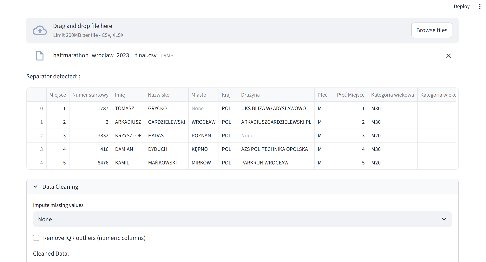
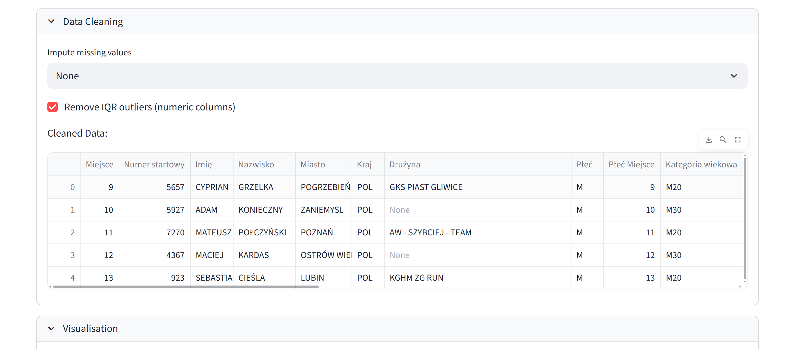
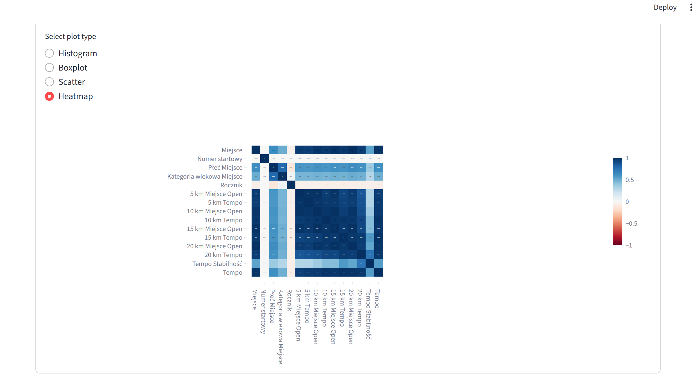

# DS Toolbox

## Overview
A Streamlit data‑science toolbox that lets users upload CSV/Excel files, clean missing values and outliers, visualize data with various plots, and train a regression model.

<!-- ## Project architecture
    in Excalidraw -->

## Main functionalities
- Upload CSV/Excel file via the Streamlit uploader.  
- Data cleaning: impute missing values (mean, median, mode) and remove IQR outliers.  
- Interactive visualisation: histogram, boxplot, scatter plot, heatmap using Plotly.  
- Train a regression model with automatic evaluation metrics.

## Technologies & skills
- Python  
- Streamlit  
- Pandas  
- Plotly  
- Scikit‑learn  

## Project Report
- Modular component architecture (data_loader, data_cleaner, visualizer, model_trainer).  
- Data ingestion and preprocessing pipeline.  
- Interactive charts rendered with Plotly in Streamlit.  
- Simple regression training routine returning metrics.

## Sample photos

<figure>
    Pic_name</figcaption>" width="600">
<!-- <figcaption>Pic_name</figcaption> -->
    Pic_name2</figcaption>" width="600">
<!-- <figcaption>Pic_name2</figcaption> -->
    Pic_name3</figcaption>" width="600">
<!-- <figcaption>Pic_name3</figcaption> -->

</figure>

## Application usage
- Upload a CSV or Excel file.  
- Use the “Data Cleaning” expander to impute missing values and remove outliers.  
- Select visualisation type in the “Visualisation” section and view interactive charts.  
- Choose target column in the “Modeling (Regression)” section, run training, and review metrics.

Write an HTML anchor tag that:
- uses class="md-button md-button--primary"  
- has the text “Go to the application”  
- keeps everything else exactly as shown below  
- **only** replaces the href value with <URL> from README.md. 

---
<a class="md-button md-button--primary" href="https://adamob-ds-toolbox.streamlit.app/" target="_blank">Go to the application</a>
---