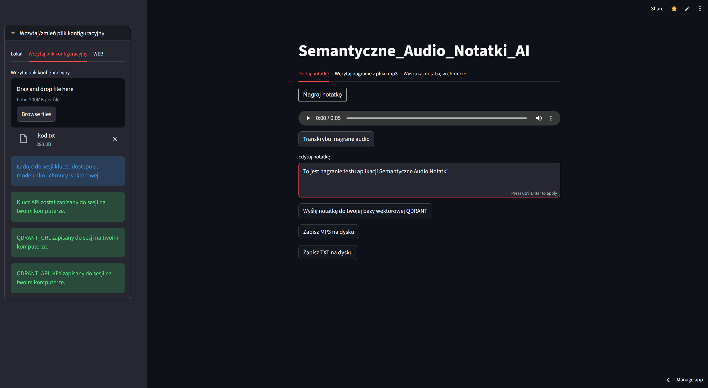

<!-- <h1 style="color:green;">WEBSITE UNDER CONSTRUCTION !</h1> -->

# Project_from the world of data and artificial intelligence

## Introduction

Welcome to the page dedicated to projects in data analysis, machine learning, and artificial intelligence. Here you’ll find projects I’ve been working on recently.

Feel free to explore—hope you discover something interesting here!

---
## My short story

In 2011, I earned a Master of Science in Engineering from the Faculty of Electrical Engineering at Warsaw University of Technology. My studies ignited my interest in new technologies.

For the past ten years, I have been gaining experience in the lighting industry, working as a lighting systems designer at two different companies. During this time, I significantly developed my skills in automating design processes. Previously, I held the position of senior product manager responsible for lighting systems. My career began after university, where I worked as an electrical network designer and successfully utilized AutoCAD.

In 2025 I was inspired by the data industry, the role of Data Scientist, and the rapidly evolving field of artificial intelligence. An opportunity arose to further develop these skills by creating AI agents—automation that is not deterministic but can adapt far better to various process‑automation tasks, thereby reducing verification time and increasing overall efficiency.

## Certificate

<!-- <figure markdown>

{ width="500px"}
<figcaption>Ładowanie pliku</figcaption>

{ width="500px"}
<figcaption>Transkrypcja</figcaption>

</figure> -->

Here's my certificate: [Certificate](../images/certificate.pdf)

<figure>
    <figcaption>Certificate</figcaption>
</figure>

<figure>
    <iframe src="../images/certificate.pdf" width="600" height="500"></iframe>
    <figcaption>Certificate</figcaption>
</figure>

# My Achievements

## Certificate of Completion

I'm proud to have completed this course!  You can download my certificate here: [Certificate](../images/certificate.pdf)

<figure>
    <figcaption>Certificate of Completion</figcaption>
</figure>

# My Achievements

## Certificate of Completion

Here's my certificate:

<figure>
    <iframe src="../images/certificate.pdf" width="600" height="500"></iframe>
    <figcaption>Certificate of Completion</figcaption>
</figure>

# My Achievements

## Certificate of Completion

Here's my certificate:

<figure>
    
    <figcaption>Certificate of Completion</figcaption>
</figure>

<figure>
    Certificate</figcaption>" width="600">
    <figcaption>Certificate</figcaption>
</figure>

<!-- 
We live in a world of incredibly fast-paced development of artificial intelligence and the influx of data and technological solutions. -->
---
## Contact
Adam Biela 
email: [bielaa3@gmail.com](mailto:bielaa3@gmail.com) 
tel: +48 506 767 998