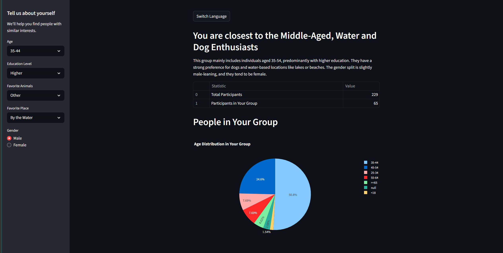
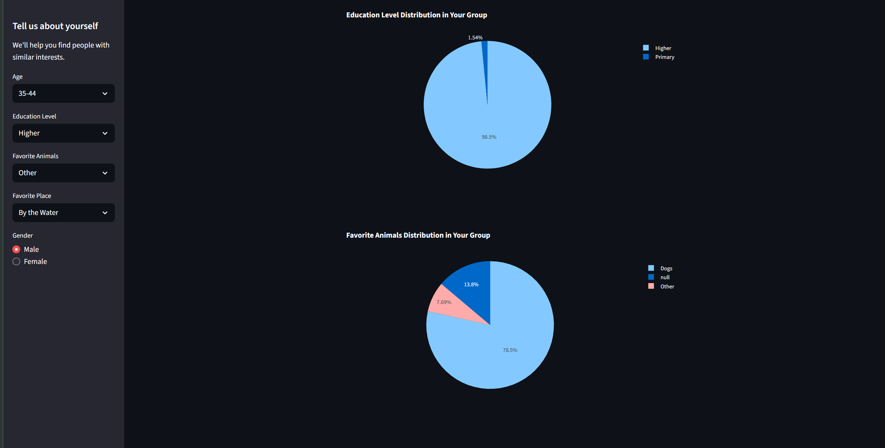
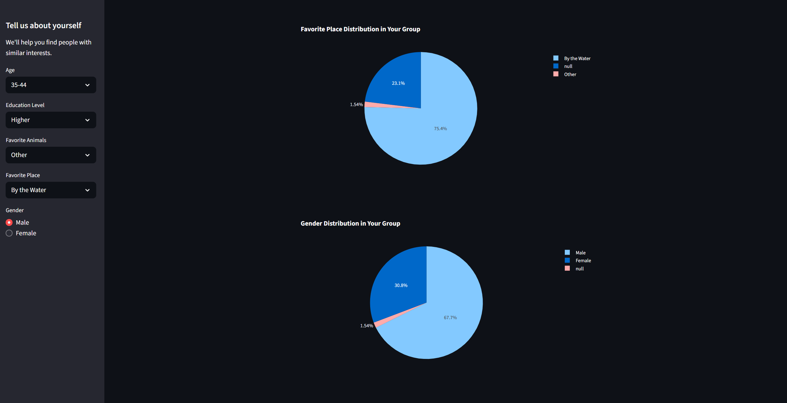

<!-- # Welcome Survey Clustering App -->

---

<a class="md-button md-button--primary" href="https://adamo-clustering-pipeline.streamlit.app/" target="_blank">Go to the application</a>

---

*Project start: Not specified*

## Overview
The Welcome Survey Clustering App is a Streamlit application that uses clustering to group participants based on their survey responses. It provides insights into the characteristics of different groups and allows users to find people with similar interests.

## Main functionalities
- Load translations from JSON files for multilingual support.
- Allow users to switch between English and Polish languages.
- Collect user input through a sidebar form, including age, education level, favorite animals, favorite place, and gender.
- Predict the cluster ID for the user based on their responses using a pre-trained clustering model.
- Display the predicted cluster's name and description.
- Show summary statistics of total participants and those in the user's group.
- Visualize categorical distributions (age, education level, favorite animals, favorite place, gender) within the user's group using pie charts.

## Technologies & skills
- Python
- Streamlit
- Pandas
- PyCaret for clustering
- Plotly Express for data visualization

## Project Report
- The app uses a pre-trained clustering model to categorize participants based on their survey responses.
- It supports multilingualism by loading translations from JSON files.
- User inputs are collected through a sidebar form, and the app predicts the user's cluster ID using the clustering model.
- The app provides visualizations of categorical distributions within the user's group.

## Sample photos

<figure>
    </figcaption>" width="600">
<figcaption>Pic_1</figcaption>
    </figcaption>" width="600">
<figcaption>Pic_2</figcaption>
    </figcaption>" width="600">
<figcaption>Pic_3</figcaption>

</figure>

Application usage
- Users can switch between English and Polish languages.
- They fill out a form with their age, education level, favorite animals, favorite place, and gender.
- The app predicts the user's cluster ID and displays the cluster's name and description.
- Users can see summary statistics and visualizations of categorical distributions within their group.

---

<a class="md-button md-button--primary" href="https://adamo-clustering-pipeline.streamlit.app/" target="_blank">Go to the application</a>

---
